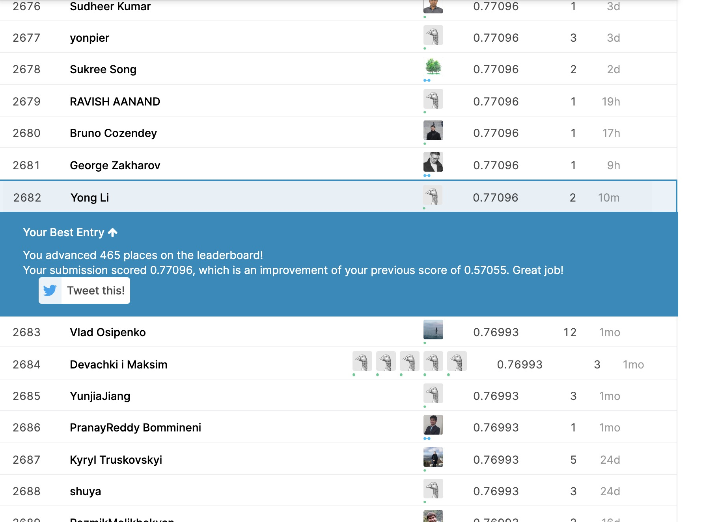

```python
import numpy as np
import pandas as pd
from sklearn import feature_extraction, linear_model, model_selection, preprocessing
```


```python
train_df = pd.read_csv("./train.csv")
test_df = pd.read_csv("./test.csv")
```

## Look at data


```python
train_df[train_df["target"] == 0]["text"].values[1]
train_df[train_df["target"] == 1]["text"].values[1]
```


    'Forest fire near La Ronge Sask. Canada'


## Buildheadg vectors


```python
count_v = feature_extraction.text.CountVectorizer()
example_train_vectors = count_v.fit_transform(train_df["text"][0:5])
train_v = count_v.fit_transform(train_df["text"])
test_v = count_v.transform(test_df["text"])
```


    array([0.59421842, 0.5642787 , 0.64082434])


## Our model


```python
clf = linear_model.RidgeClassifier()
scores = model_selection.cross_val_score(clf, train_vectors, train_df["target"], cv=3, scoring="f1")
scores
```

predictions on our training set and build a submission for the competition.


```python
clf.fit(train_vectors, train_df["target"])
sample_submission = pd.read_csv("./sample_submission.csv")
```


```python
sample_submission["target"] = clf.predict(test_vectors)
sample_submission.head()
```


<div>
<style scoped>
    .dataframe tbody tr th:only-of-type {
        vertical-align: middle;
    }

    .dataframe tbody tr th {
        vertical-align: top;
    }

    .dataframe thead th {
        text-align: right;
    }
</style>
<table border="1" class="dataframe">
  <thead>
    <tr style="text-align: right;">
      <th></th>
      <th>id</th>
      <th>target</th>
    </tr>
  </thead>
  <tbody>
    <tr>
      <th>0</th>
      <td>0</td>
      <td>0</td>
    </tr>
    <tr>
      <th>1</th>
      <td>2</td>
      <td>1</td>
    </tr>
    <tr>
      <th>2</th>
      <td>3</td>
      <td>1</td>
    </tr>
    <tr>
      <th>3</th>
      <td>9</td>
      <td>0</td>
    </tr>
    <tr>
      <th>4</th>
      <td>11</td>
      <td>1</td>
    </tr>
  </tbody>
</table>
</div>


```python
sample_submission.to_csv("submission.csv", index=False)
```

